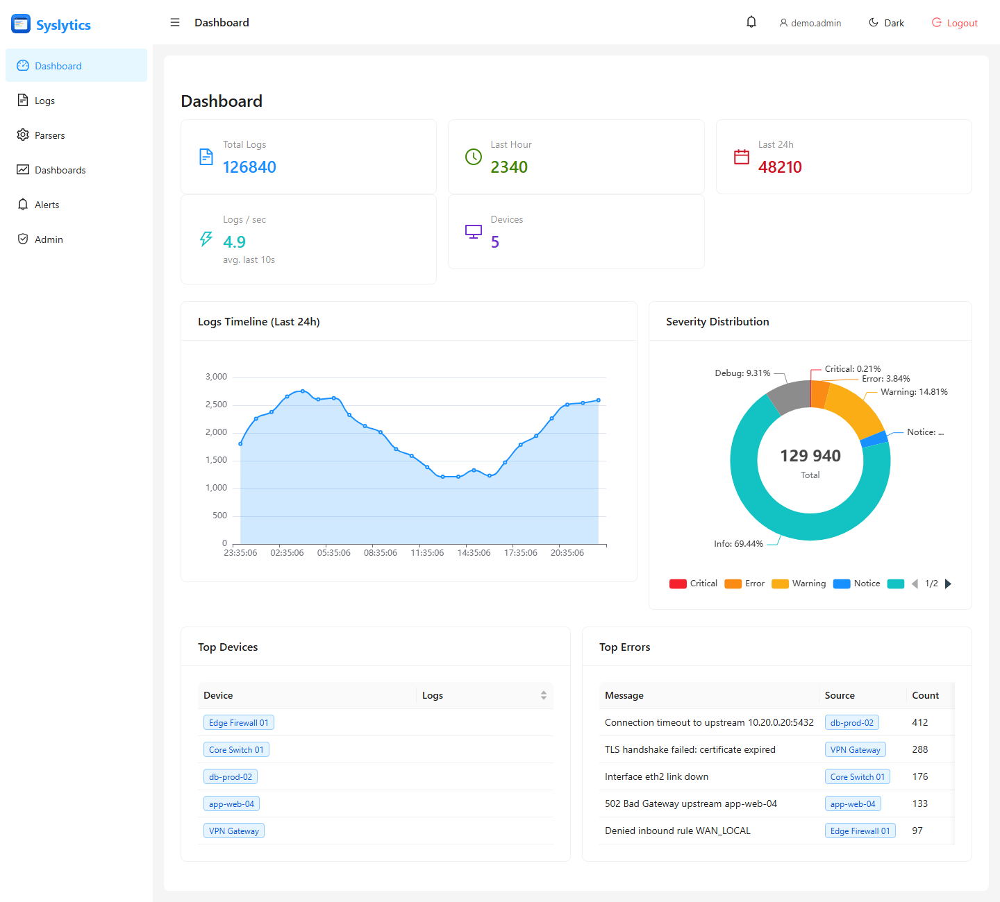
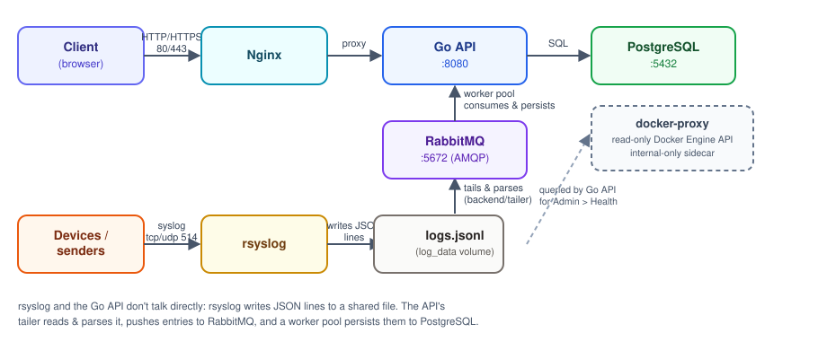
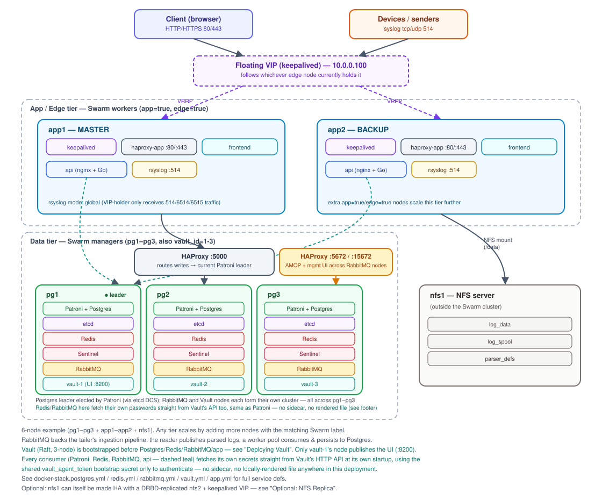
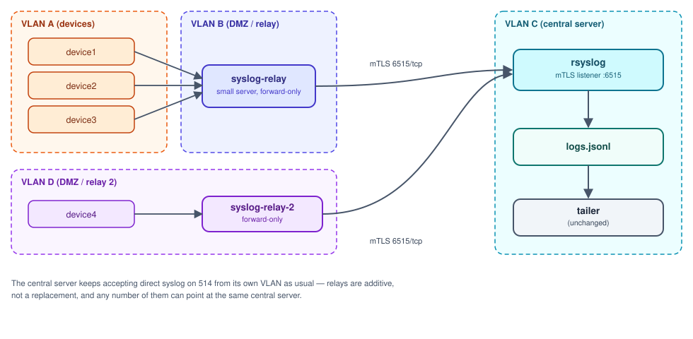

<p align="center">
  
</p>

<h1 align="center">Logmara 📡</h1>

<p align="center">

[](LICENSE)


</p>

**Logmara is a self-hosted, [Docker Compose](#quick-start-single-server)-deployed platform for ingesting, parsing, and visualizing syslog data** — a live log viewer, a regex-based parser engine for structuring raw messages, custom dashboards, alerting, and an admin panel, all behind JWT auth with no external dependencies.

Project website: **[logmara.com](https://logmara.com)**

<p align="center">
  
</p>

## Demo

A live demo is available at **[demo.logmara.com](https://demo.logmara.com)**:

| Field | Value |
|-------|-------|
| Username | `demo` |
| Password | `Demouser12@` |

## Architecture

<p align="center">
  
</p>

`rsyslog` and the Go API don't talk to each other directly - `rsyslog` writes ingested logs as JSON lines to a shared file (`logs.jsonl` on the `log_data` volume), and the API's file tailer (`backend/tailer/`) reads and parses that file, then persists parsed entries to PostgreSQL.

| Service | Port(s) | Description |
|---------|---------|-------------|
| Frontend | 80 (443 if HTTPS is enabled, see Admin > Settings) | React SPA served via Nginx |
| API | 8080 | Gin REST API with JWT auth; tails rsyslog's JSONL output into PostgreSQL |
| rsyslog | 514 (TCP/UDP); 6514 (TLS, no client cert - same ingestion as 514, just encrypted); 6515 (mTLS, optional relay ingestion - see [Syslog Relay](#syslog-relay-optional-multi-vlan)) | Syslog ingestion daemon |
| PostgreSQL | 5432 | Persistent log storage |
| docker-proxy | *(internal only, not published to the host)* | Read-only Docker Engine API sidecar backing [Health Monitoring](#health-monitoring) |

## Features

- 📜 **Live Log Viewer** — Browse, filter, and search ingested syslog messages in real-time
- 🧩 **Parser Engine** — Define regex-based parsers to extract structured fields from raw log lines
- 📊 **Custom Dashboards** — Create dashboards filtered by device, severity, or parsed fields
- 📌 **Pin Dashboards** — Pin frequently-used dashboards to the sidebar for quick access
- 📤 **Export** — Download logs as CSV or HTML reports
- 📈 **Statistics** — Timeline charts, severity breakdown, and per-device metrics
- 🔐 **Secure Authentication** — JWT access tokens (configurable timeout) + refresh tokens (7 days, or 60 with "remember this device" at login) with rotation, JWT blacklisting on logout
- 📱 **Session Management** — Review and sign out your own active sessions/devices from the navbar (`GET`/`DELETE /api/auth/sessions`)
- 🔒 **Account Lockout** — Automatic lockout after configurable failed login attempts, admin unlock from Admin panel
- 🛡️ **CSRF Protection** — Double-submit cookie pattern on all mutating endpoints
- 🪪 **LDAP/AD Integration** — Authenticate against Active Directory or OpenLDAP with TLS support
- 📝 **Audit Logging** — Track login attempts, lockouts, unlocks, password changes, and admin actions
- ⏱️ **Rate Limiting** — Login endpoint protected against brute-force attacks (Redis-shared in HA mode)
- 🌐 **CORS Protection** — Configurable allowed origins
- 🧙 **Setup Wizard** — Guided initial configuration with admin account, database, security keys, and optional LDAP/CORS
- 🛠️ **Admin Panel** — User management, settings, audit log viewer, LDAP connection test
- 🩺 **Health Monitoring** — Container/Swarm service status and syslog relay liveness in one place (see [Health Monitoring](#health-monitoring))

## Quick Start (Single Server)

This is the default, fully-supported deployment path: **one server, one command, everything included** — frontend, API, rsyslog ingestion, and PostgreSQL all start together from `docker-compose.yml` (see the Architecture diagram above), nothing to set up separately. It is unaffected by the optional High Availability path below; skip that section entirely unless you specifically need to survive losing an entire server.

### Requirements

- One Linux server (any distro with a current kernel), reachable from wherever your browser and syslog senders are.
- Nothing else needs to be pre-installed — the steps below install Docker for you.

### 1. Install Docker

```bash
curl -fsSL https://get.docker.com | sh
sudo systemctl enable --now docker
sudo usermod -aG docker "$USER"   # log out/in for this to take effect
```

### 2. Open firewall ports

Only two things need to be reachable from outside the server:
- `80/tcp` (and `443/tcp` if you enable HTTPS later from the admin Settings UI) — the web UI/API, reverse-proxied through nginx.
- `514/tcp` and `514/udp` — syslog ingestion, from whatever devices will send logs here.

```bash
# Example using ufw - adjust to your actual firewall/security group
sudo ufw allow 80,443/tcp
sudo ufw allow 514/tcp
sudo ufw allow 514/udp
```

> [!NOTE]
> `8080/tcp` (the API) is also published by `docker-compose.yml`, but only needed if you want to hit the API directly instead of through nginx on 80/443 — leave it firewalled off unless you have a specific reason to open it.

### 3. Download the compose file and configure

No need to clone the whole repo — this uses [pre-built images](#pre-built-images) from Docker Hub, so the compose file and env template are all you need:

```bash
mkdir logmara && cd logmara
curl -fsSLO https://raw.githubusercontent.com/dom133/Logmara/master/docker-compose.yml
curl -fsSLO https://raw.githubusercontent.com/dom133/Logmara/master/.env.example
cp .env.example .env
```

Edit `.env` and set at least these — the app **will not start** until the two security keys are set (they have no defaults, by design; see [Security keys](#security-keys)):
- `POSTGRES_PASSWORD`
- `JWT_SECRET` — generate with `openssl rand -base64 48`
- `ENCRYPTION_KEY` — generate with `openssl rand -base64 48` (use a *separate* value from `JWT_SECRET`)

### 4. Start it

```bash
docker compose up -d
```

`-d` runs it in the background so it survives you logging out. Every service already has `restart: unless-stopped` in `docker-compose.yml`, and `systemctl enable docker` from step 1 means Docker itself starts on boot — so the stack comes back up automatically after a server reboot, no extra systemd unit needed.

Check it actually came up:
```bash
docker compose ps          # all services should show "healthy" or "running"
docker compose logs -f     # follow logs if something looks wrong
```

### 5. First login

Open `http://<server-ip>` in a browser and complete the Setup Wizard (creates the admin account and, if `DATABASE_URL` wasn't set, the database connection). The JWT and encryption keys are taken from the environment (step 3), so the wizard has no key step — if they're missing it shows a notice instead and initialization is blocked until you set them and restart. On subsequent launches, log in with the account you created there.

### Updating later

```bash
docker compose pull
docker compose up -d
```

Bump `IMAGE_TAG` in `.env` first if you want to move to a specific newer release instead of whatever `docker-compose.yml`'s default currently points to.

### Deploying local changes / building from source

Only needed if you've modified the code, or want something not yet published under `dom133/logmara-*` on Docker Hub — otherwise stick with the steps above.

```bash
git clone https://github.com/dom133/Logmara.git
cd syslog_gui
cp .env.example .env   # fill in POSTGRES_PASSWORD, JWT_SECRET, ENCRYPTION_KEY as above
docker compose -f docker-compose.build.yml up -d --build
```

`docker-compose.build.yml` is identical to `docker-compose.yml` except every service builds from the local `Dockerfile.*` instead of pulling from Docker Hub. Update the same way with `git pull` followed by the same `up -d --build` command.

## Pre-built Images

Pre-built images are published on Docker Hub under [`dom133`](https://hub.docker.com/u/dom133), tagged `v0.0.1`:

- [`dom133/logmara-api:v0.0.1`](https://hub.docker.com/r/dom133/logmara-api) (built from `Dockerfile.backend`)
- [`dom133/logmara-frontend:v0.0.1`](https://hub.docker.com/r/dom133/logmara-frontend)
- [`dom133/logmara-rsyslog:v0.0.1`](https://hub.docker.com/r/dom133/logmara-rsyslog)
- [`dom133/logmara-rsyslog-relay:v0.0.1`](https://hub.docker.com/r/dom133/logmara-rsyslog-relay)
- [`dom133/logmara-patroni:v0.0.1`](https://hub.docker.com/r/dom133/logmara-patroni)

`docker-compose.yml` pulls these by default (`image:`, pinned via `${IMAGE_TAG:-v0.0.1}` in `.env`) — this is what the [Quick Start](#quick-start-single-server) above uses, no clone or build needed. Need to build from source instead (local changes, or something not yet published)? Use `docker-compose.build.yml` — see [Deploying local changes / building from source](#deploying-local-changes--building-from-source).

These are also a drop-in `REGISTRY`/`TAG` pair for the [High Availability](#high-availability-deployment-multi-node-optional) deployment below (`REGISTRY=dom133 TAG=v0.0.1`), since the image names match what `docker-stack.app.yml`/`docker-stack.postgres.yml` expect — see [step 4](#4-clone-the-repo-then-buildpush-or-use-pre-built-images).

## Configuration

Copy `.env.example` and adjust values:

| Variable | Default | Description |
|----------|---------|-------------|
| `DATABASE_URL` | *(none)* | PostgreSQL connection string. In `docker-compose.yml` this is always set. If unset, the API serves only the setup wizard until it's submitted with database settings, then connects and continues booting on its own |
| `JWT_SECRET` | *(required)* | JWT signing key (min 32 chars). Env-only, never stored in the DB. Also accepts `JWT_SECRET_FILE`. See [Security keys](#security-keys) |
| `ENCRYPTION_KEY` | *(required)* | AES-256 key for encrypting sensitive settings (SMTP/LDAP passwords, channel secrets). Env-only, never stored in the DB. Also accepts `ENCRYPTION_KEY_FILE` |
| `PORT` | `8080` | API server port |
| `LOG_FILE_PATH` | `/data/logs.jsonl` | Path to rsyslog JSON output |
| `CORS_ORIGINS` | *(none)* | Comma-separated allowed origins for CORS. Only seeds the initial value in the database on first initialization — afterwards it's managed from the admin Settings UI |
| `LDAP_SERVER` | *(none)* | LDAP/AD server hostname |
| `LDAP_PORT` | `636` | LDAP server port |
| `LDAP_USE_TLS` | `true` | Enable TLS for LDAP |
| `LDAP_VERIFY_CERT` | `true` | Verify LDAP server certificate |
| `LDAP_CA_CERT` | *(none)* | Path to CA certificate for LDAP |
| `LDAP_BASE_DN` | *(none)* | Base DN for user search |
| `LDAP_BIND_DN` | *(none)* | Bind DN for LDAP queries |
| `LDAP_BIND_PASSWORD` | *(none)* | Bind password for LDAP queries |
| `DOCKER_PROXY_URL` | `http://docker-proxy:2375` | Base URL of the `docker-proxy` sidecar backing Admin > Health — see [Health Monitoring](#health-monitoring) |
| `PARSER_DEFS_DIR` | *(none — embedded defaults only)* | Directory the builtin parser definitions (`backend/db/parsers`) are bootstrapped into and re-read from on every start. Set this (and mount a persistent volume there) to edit/add/remove builtin parsers without rebuilding the image — see [Built-in Parsers](#built-in-parsers) |

### Security keys

Logmara uses two secrets that are read **only from the environment** and are **never written to the database**:

- **`JWT_SECRET`** — signs session tokens. Anyone who has it can forge a login for any user.
- **`ENCRYPTION_KEY`** — AES-256 key that encrypts sensitive settings at rest (SMTP/LDAP bind passwords, notification-channel secrets).

Keeping them out of the database is deliberate: it means a database dump on its own can neither forge tokens nor decrypt stored credentials — the attacker would also need the environment. Because of this, **there is no auto-generation and no setup-wizard step for them** — you generate them yourself before the first start, and the app refuses to start (or to finish first-time setup) until both are present.

**Generate them** (use a *different* value for each; minimum 32 characters):

```bash
openssl rand -base64 48   # use the output as JWT_SECRET
openssl rand -base64 48   # run again, use the output as ENCRYPTION_KEY
```

**Single-server (`docker-compose.yml`)** — put both in `.env`:

```bash
echo "JWT_SECRET=$(openssl rand -base64 48)"     >> .env
echo "ENCRYPTION_KEY=$(openssl rand -base64 48)" >> .env
```

**High Availability (`docker-stack.*.yml`)** — export them in the shell you run `docker stack deploy` from (or keep them in the same `.env` you source), so every node's `api` replica receives them:

```bash
export JWT_SECRET=$(openssl rand -base64 48)
export ENCRYPTION_KEY=$(openssl rand -base64 48)
```

**File-based secrets (optional)** — instead of the plain env var, point `JWT_SECRET_FILE` / `ENCRYPTION_KEY_FILE` at a mounted file (e.g. a Docker/Swarm secret at `/run/secrets/jwt_secret`). The value is read from the file, trimmed of trailing newlines. This keeps the secret off the process environment (which leaks via `docker inspect` and `/proc`).

> [!IMPORTANT]
> Keep both values **stable**. Changing `JWT_SECRET` logs everyone out; changing `ENCRYPTION_KEY` makes every previously-encrypted setting unreadable (you'd have to re-enter SMTP/LDAP passwords and channel secrets).

> [!NOTE]
> **Upgrading an older install** that let the app auto-generate these into the database? Before updating, copy the existing values out into your environment so sessions and encrypted settings keep working:
> ```bash
> docker compose exec -T postgres psql -U "$POSTGRES_USER" -d "$POSTGRES_DB" -tAc \
>   "SELECT key || '=' || value FROM app_settings WHERE key IN ('jwt_secret','encryption_key')"
> ```
> Put the two printed values into `.env` as `JWT_SECRET=` / `ENCRYPTION_KEY=`, then `docker compose up -d --build`. The old rows left in `app_settings` are ignored from then on and can be deleted.

## High Availability Deployment (Multi-Node, Optional)

An additional, opt-in deployment path for surviving the loss of an entire server, not just a container. It does not replace or modify the single-server `docker-compose.yml` path above — that keeps working exactly as documented whether or not you ever use this section.

**Scope**: this gives *true* horizontal scale-out for `api`/`frontend` (multiple replicas serving traffic concurrently, not just failover) and *true* HA for PostgreSQL (automatic leader election/failover via Patroni) and Redis (automatic leader election/failover via Sentinel). `rsyslog` remains single-active-writer by design (see below), which is a correctness requirement, not a current limitation.

Getting here required backend code changes (not just Docker config) — see "How multi-replica safety works" below for what changed and why.

<p align="center">
  
</p>

### Requirements

- **4+ Linux servers**, Docker installed, all mutually reachable. Recommended minimum split: 3 dedicated to Postgres, 3 for Redis Sentinel (can overlap with the app tier on small clusters), 2+ for the app tier (`api`/`frontend`/`rsyslog`/`haproxy-app`) so that tier also survives a single node failure.
- A container image registry every node can pull from (e.g. a private registry, GHCR, ECR).
- An NFS export (or equivalent shared filesystem — Ceph, GlusterFS, etc. if you already run one) reachable from every app/edge node, for the shared `/data` (raw logs, TLS certs, nginx conf snippets). A single NFS box is a SPOF for that shared storage; see [Optional: NFS Replica](#optional-nfs-replica-drbd--keepalived) below if you want it synchronously replicated instead.
- Two or more externally-routable IPs on the edge nodes for the keepalived VIP — this now fronts `rsyslog` (raw TCP/UDP, unproxied) *and* load-balanced HTTP/API access via `haproxy-app`, so make sure it's reachable from wherever both syslog senders and browser/API clients sit.

### Files

| File | Purpose |
|------|---------|
| [`docker-stack.postgres.yml`](docker-stack.postgres.yml) | etcd (3-node DCS) + Patroni-managed Postgres (3 nodes) + HAProxy routing writes to the current leader |
| [`Dockerfile.patroni`](Dockerfile.patroni), [`patroni/`](patroni/) | Patroni on top of the same `postgres:16-alpine` base as `docker-compose.yml` |
| [`haproxy/haproxy.cfg`](haproxy/haproxy.cfg) | Routes `:5000` to whichever Postgres node's Patroni REST API reports itself as primary |
| [`docker-stack.redis.yml`](docker-stack.redis.yml) | 3-node Redis + 3-node Sentinel, backing `backend/sharedstate` (rate limiting, cache invalidation, tailer leader election, ingestion control, slow-query log) |
| [`redis/sentinel.conf.tpl`](redis/sentinel.conf.tpl) | Sentinel config template loaded as a Swarm config at deploy time |
| [`docker-stack.app.yml`](docker-stack.app.yml) | `api`, `rsyslog`, `frontend`, `haproxy-app` as Swarm services with real `deploy:` (placement, restart, update policy, `api`/`frontend` at `${API_REPLICAS:-2}`/`${FRONTEND_REPLICAS:-2}`) |
| [`haproxy/haproxy-app.cfg`](haproxy/haproxy-app.cfg) | Load-balances `:80`/`:443` across every `frontend` replica cluster-wide (`tasks.frontend`), and internally load-balances every `api` replica (`tasks.api`) on `:8090` for nginx's `/api/` proxy_pass; the API is never published directly to the host. Preserves the real client IP across both hops - `option forwardfor` on `:80`, a PROXY protocol header (`send-proxy`) on `:443` since that one's a raw TLS passthrough (paired with `NGINX_PROXY_PROTOCOL=true` on the `api` service, consumed by `backend/handler/admin.go`'s generated `https.conf`) - so audit log IPs and API key IP allowlists see the actual caller, not an internal overlay address |
| [`keepalived/`](keepalived/) | VRRP config template + health-check scripts (`rsyslog` and `haproxy-app`) for the floating app/edge VIP |
| [`scripts/swarm-bootstrap.sh`](scripts/swarm-bootstrap.sh) | Guided commands for swarm init/join, node labeling, network/secret/config creation |
| [`nfs-ha/`](nfs-ha/) | *Optional* — DRBD resource template + keepalived VIP + promote/demote hooks for a synchronously-replicated NFS pair, instead of a single NFS box |

### How multi-replica safety works

Running more than one `api`/`frontend` replica used to be unsafe: an in-memory rate limiter and stat caches would silently diverge per replica, the log-file tailer would double-ingest if two instances tailed the same file, and nginx config pushes only ever reached one frontend replica. `backend/sharedstate` (backed by the Redis/Sentinel stack above) fixes all of it:

- **Rate limiting** (`backend/main.go`) — a Lua script does an atomic sliding-window check against Redis instead of an in-process map, so limits are shared across every replica.
- **Tailer leader election** (`backend/tailer/tailer.go`) — a Redis lock (`SET NX PX` + periodic renew, the standard Redis distributed-lock pattern) ensures exactly one `api` replica is ever actively tailing/flushing/compacting `logs.jsonl` at a time; losing the lock (crash, node loss) lets another replica take over within a few seconds.
- **Cache invalidation** (`backend/handler/stats.go`, `logs.go`) — a purge or alias update now publishes over Redis pub/sub so every replica's local cache clears, not just the one that handled the request.
- **Ingestion pause/resume** (`backend/control/ingestion.go`) — the pause flag lives in Redis with a local cached copy kept current via pub/sub, so `GET /admin/ingestion/status` is consistent no matter which replica answers.
- **Slow-query log** (`backend/handler/slow_query_logger.go`) — moved from a per-process in-memory ring buffer to a Redis list, so the admin view is consistent across replicas.
- **Migration safety** (`backend/db/db.go`'s `MigrateWithLock`) — a Postgres advisory lock serializes concurrent replicas' schema migrations on startup/rolling deploy, independent of Redis.
- **Nginx reload fan-out** (`backend/handler/admin.go`) — resolves `NGINX_RELOAD_TARGETS_HOST` (Swarm's `tasks.frontend`, which returns every replica's task IP) and reloads each one in parallel instead of hitting a single fixed URL.

**All of this is opt-in and additive**: none of it activates unless `REDIS_SENTINEL_ADDRS` (or `REDIS_ADDR`) is set. Without it — the single-server `docker-compose.yml` path, and any deployment that simply doesn't set those vars — every one of the above falls back to exactly its original single-process, in-memory behavior. See `backend/sharedstate/client.go`'s `Connect()` doc comment for details.

`rsyslog` is deliberately **not** part of this scale-out: it stays `mode: global` on `edge=true` nodes behind the keepalived VIP (only the node currently holding the VIP receives traffic, so there's still only one active writer to `logs.jsonl` at any time) — this is what keeps the real sender IP intact for `fromhost_ip` parser matching, which a load-balanced/scaled ingestion tier would lose.

### Deployment steps (from scratch)

This walks through everything from bare servers to a working cluster, using a concrete 6-machine example. Substitute your own hostnames/IPs throughout.

#### 0. Example topology

| Node | Example IP | Swarm role | Labels | Runs |
|---|---|---|---|---|
| `pg1` | 10.0.0.11 | manager | `pg_id=1`, `cache_id=1` | Postgres (Patroni), etcd, Redis, Sentinel |
| `pg2` | 10.0.0.12 | manager | `pg_id=2`, `cache_id=2` | Postgres (Patroni), etcd, Redis, Sentinel |
| `pg3` | 10.0.0.13 | manager | `pg_id=3`, `cache_id=3` | Postgres (Patroni), etcd, Redis, Sentinel |
| `app1` | 10.0.0.21 | worker | `app=true`, `edge=true` | api, frontend, haproxy, rsyslog, keepalived |
| `app2` | 10.0.0.22 | worker | `app=true`, `edge=true` | api, frontend, haproxy, rsyslog, keepalived |
| `nfs1` | 10.0.0.30 | *(not in the swarm)* | — | NFS server for `/data` |

Managers double as the 3 Postgres + 3 Redis nodes (odd number, needed for etcd/Sentinel quorum either way) — this keeps the example to 6 machines total. Workers run everything that needs `app=true`/`edge=true`; with 2 of them, both `api`/`frontend` replicas and rsyslog/keepalived survive losing either one. Scale any tier up by adding more nodes with the matching label instead of changing this topology.

`nfs1` is a plain Linux box outside the swarm — it only needs to be network-reachable from `app1`/`app2`. You can reuse an existing NFS/Ceph/GlusterFS server instead of standing up a new one; adjust step 2 accordingly.

#### 1. Install Docker on every swarm node (`pg1`-`pg3`, `app1`-`app2`)

```bash
curl -fsSL https://get.docker.com | sh
sudo systemctl enable --now docker
sudo usermod -aG docker "$USER"   # log out/in for this to take effect
```

#### 2. Open firewall ports between nodes

Swarm itself needs, between every swarm node (`pg1`-`pg3`, `app1`-`app2`):
- `2377/tcp` — cluster management (managers only need to accept this)
- `7946/tcp` and `7946/udp` — node gossip
- `4789/udp` — overlay network data (VXLAN)

Everything else (Postgres 5432, Patroni's REST API 8008, etcd 2379/2380, Redis 6379, Sentinel 26379) travels over the `syslog_net` overlay network via that same VXLAN tunnel — you do **not** need to open those ports individually between nodes.

What *does* need opening beyond the swarm nodes themselves:
- `app1`/`app2`: `80/tcp`, `443/tcp` (`haproxy-app`, published with `mode: host` — `frontend` itself is no longer published) and `514/tcp`+`514/udp` (rsyslog, also `mode: host`) to whatever network your users/log senders are on. `8080/tcp` (the API) is never published — all API traffic is routed through nginx on `80`/`443`. `7001/tcp` (`haproxy-app`'s stats page) is also published with `mode: host` for the failover test below — it has no `stats auth`, so only open it to trusted/admin source IPs, never to the same network as `80`/`443`.
- `nfs1`: `2049/tcp` (NFS) and `111/tcp`+`111/udp` (portmapper), open to `app1`/`app2` specifically. If you deploy the optional [DRBD-replicated NFS pair](#optional-nfs-replica-drbd--keepalived) instead, `nfs1`/`nfs2` also need `7789/tcp` (DRBD replication) open to each other.

```bash
# Example using ufw on app1/app2 - adjust to your actual firewall/security groups
sudo ufw allow from 10.0.0.0/24 to any port 2377,7946 proto tcp
sudo ufw allow from 10.0.0.0/24 to any port 7946,4789 proto udp
sudo ufw allow 80,443,514/tcp
sudo ufw allow 514/udp
```

#### 3. Set up the NFS export (`nfs1`)

```bash
sudo apt-get install -y nfs-kernel-server
sudo mkdir -p /srv/syslog-ha/nfs/log_data /srv/syslog-ha/nfs/log_spool /srv/syslog-ha/nfs/parser_defs
sudo chown -R nobody:nogroup /srv/syslog-ha/nfs
echo '/srv/syslog-ha/nfs/log_data     10.0.0.21(rw,sync,no_subtree_check) 10.0.0.22(rw,sync,no_subtree_check)' | sudo tee -a /etc/exports
echo '/srv/syslog-ha/nfs/log_spool    10.0.0.21(rw,sync,no_subtree_check) 10.0.0.22(rw,sync,no_subtree_check)' | sudo tee -a /etc/exports
echo '/srv/syslog-ha/nfs/parser_defs  10.0.0.21(rw,sync,no_subtree_check) 10.0.0.22(rw,sync,no_subtree_check)' | sudo tee -a /etc/exports
sudo exportfs -ra
sudo systemctl enable --now nfs-kernel-server
```

On `app1`/`app2`, install the NFS client (Docker's `local` volume driver shells out to it for `type: nfs` volumes — see `docker-stack.app.yml`):

```bash
sudo apt-get install -y nfs-common
```

#### 4. Clone the repo, then build/push (or use pre-built) images

Unlike the single-server [Quick Start](#quick-start-single-server) above, this path still needs a full repo clone regardless of which images you end up running — the stack YAMLs alone aren't enough, since `haproxy/`, `redis/`, `keepalived/`, `nfs-ha/` and `scripts/swarm-bootstrap.sh` supply the configs/templates/helper scripts every step below depends on.

Pick one manager (`pg1` here) as your "control" node — everywhere below that says "run on a manager", run it there, over SSH, against `pg1`'s local Docker socket. You'll also need a container image registry every node can pull from.

> [!TIP]
> If you haven't modified the code, you can skip *building* (not cloning) and pull the [pre-built `v0.0.1` images](#pre-built-images) from Docker Hub instead — `docker login` on every node (or add `--with-registry-auth` to the `docker stack deploy` commands later), then just use `REGISTRY=dom133 TAG=v0.0.1` in steps 4 and 10 instead of building/pushing your own.

**Registry options:**
- A managed registry (GHCR, ECR, Docker Hub, ...) — simplest if your nodes have internet access. `docker login` on every node, add `--with-registry-auth` to the `docker stack deploy` commands later.
- A private `registry:2` container, if they don't. Run it **on a Postgres/manager node (`pg1`-`pg3`), never on `app1`/`app2`** — `docker-stack.app.yml`'s `haproxy` service publishes port `5000` in `mode: host` on every `app=true` node, and the stock `registry:2` image also defaults to port `5000`; running both on the same node means whichever starts second fails to bind the port and gets stuck at a reduced replica count.

  On `pg1`:
  ```bash
  sudo mkdir -p /srv/syslog-ha/registry
  docker run -d --name registry --restart=always -p 5000:5000 \
    -v /srv/syslog-ha/registry:/var/lib/registry registry:2
  ```

  This serves plain HTTP (no TLS), so every node that builds or pulls images needs to be told to trust it — on **every** swarm node (`pg1`-`pg3`, `app1`-`app2`):
  ```bash
  echo '{ "insecure-registries": ["<pg1-ip>:5000"] }' | sudo tee /etc/docker/daemon.json
  sudo systemctl restart docker
  ```
  If `/etc/docker/daemon.json` already has other content, merge the key in by hand instead of overwriting the file. Verify with `docker info --format '{{.RegistryConfig.IndexConfigs}}'` — it should list `<pg1-ip>:5000` with `Secure:false`.

  Use `REGISTRY=<pg1-ip>:5000/logmara` in place of `registry.example.com/logmara` everywhere below.

```bash
ssh pg1
git clone https://github.com/dom133/Logmara.git
cd syslog_gui

export REGISTRY=registry.example.com/logmara TAG=v1
docker build -f Dockerfile.backend  -t $REGISTRY/logmara-api:$TAG .
docker build -f Dockerfile.rsyslog  -t $REGISTRY/logmara-rsyslog:$TAG .
docker build -f Dockerfile.frontend -t $REGISTRY/logmara-frontend:$TAG .
docker build -f Dockerfile.patroni  -t $REGISTRY/logmara-patroni:$TAG .
docker push $REGISTRY/logmara-api:$TAG
docker push $REGISTRY/logmara-rsyslog:$TAG
docker push $REGISTRY/logmara-frontend:$TAG
docker push $REGISTRY/logmara-patroni:$TAG
```

#### 5. Initialize the swarm and join the other nodes

On `pg1`:
```bash
./scripts/swarm-bootstrap.sh init-manager 10.0.0.11
# prints a manager join token and a worker join token - copy both
```

On `pg2` and `pg3` (as additional managers, for etcd/Sentinel quorum):
```bash
docker swarm join --token <manager-token> 10.0.0.11:2377
```

On `app1` and `app2` (as workers):
```bash
docker swarm join --token <worker-token> 10.0.0.11:2377
```

Verify from `pg1`: `docker node ls` should list all 5 nodes as `Ready`.

#### 6. Label the nodes

Back on `pg1`:
```bash
./scripts/swarm-bootstrap.sh label-pg pg1 1
./scripts/swarm-bootstrap.sh label-pg pg2 2
./scripts/swarm-bootstrap.sh label-pg pg3 3
./scripts/swarm-bootstrap.sh label-cache pg1 1
./scripts/swarm-bootstrap.sh label-cache pg2 2
./scripts/swarm-bootstrap.sh label-cache pg3 3
./scripts/swarm-bootstrap.sh label-app app1
./scripts/swarm-bootstrap.sh label-app app2
./scripts/swarm-bootstrap.sh label-edge app1
./scripts/swarm-bootstrap.sh label-edge app2
```

#### 7. Create the shared network, secrets, and configs

Still on `pg1`:
```bash
./scripts/swarm-bootstrap.sh network

PG_SUPERUSER_PASS=$(openssl rand -base64 32)
PG_REPLICATION_PASS=$(openssl rand -base64 32)
PG_APP_PASS=$(openssl rand -base64 32)
REDIS_PASS=$(openssl rand -base64 32)
JWT_SECRET_VAL=$(openssl rand -base64 48)
ENCRYPTION_KEY_VAL=$(openssl rand -base64 48)   # separate value; see "Security keys"

./scripts/swarm-bootstrap.sh secrets "$PG_SUPERUSER_PASS" "$PG_REPLICATION_PASS" "$PG_APP_PASS"
./scripts/swarm-bootstrap.sh redis-secret "$REDIS_PASS"
./scripts/swarm-bootstrap.sh app-secrets "$JWT_SECRET_VAL" "$ENCRYPTION_KEY_VAL"
./scripts/swarm-bootstrap.sh haproxy-config
./scripts/swarm-bootstrap.sh haproxy-app-config
./scripts/swarm-bootstrap.sh redis-sentinel-config
```
All four passwords/keys now live only as Swarm secrets (mounted into the relevant containers at `/run/secrets/*`) - none of them need to be exported as shell env vars again in step 10, and none of them appear in `docker service inspect`. Just note them somewhere safe (e.g. a password manager) in case you need to recreate a secret later.

#### 8. Create local data directories on the Postgres nodes

On each of `pg1`, `pg2`, `pg3`:
```bash
sudo mkdir -p /srv/syslog-ha/pg /srv/syslog-ha/etcd
```
These are node-local bind mounts, deliberately *not* on the shared NFS — Patroni replicates via WAL streaming, not a shared filesystem, and two Postgres instances sharing one data directory would corrupt it. Ownership is fixed up automatically by the Patroni container's entrypoint on first start. Redis needs no data directories at all (deliberately non-persistent — see `docker-stack.redis.yml`'s comments).

#### 9. Deploy Postgres, then Redis

On `pg1`:
```bash
docker stack deploy -c docker-stack.postgres.yml logmara-pg
watch docker service ls   # wait for postgres1/2/3 and etcd1/2/3 at 1/1, haproxy at 2/2
```

Once that's healthy:
```bash
docker stack deploy -c docker-stack.redis.yml logmara-redis
watch docker service ls   # wait for redis1/2/3 and sentinel1/2/3 at 1/1
```

Sanity-check leader election worked: `docker exec -it $(docker ps -qf name=logmara-pg_postgres1) curl -s localhost:8008/` should show `"role": "master"` on exactly one of `postgres1/2/3`.

**Troubleshooting: a replica is stuck at `0/1` and never joins.** `docker service logs logmara-pg_postgres<N>` repeatedly shows `bootstrap from leader '...' in progress` followed by `Cancelling long running task` and `pg_basebackup exited with code=-15` every ~30-40s. This isn't the replica's own network or disk — a raw `iperf3`/`dd` test between the same two hosts will look perfectly healthy. Two things worth checking, in order:

1. **Stuck replication backends on the leader.** After several failed/killed bootstrap attempts, check for backends that never got cleaned up:
   ```bash
   docker exec $(docker ps -qf name=logmara-pg_postgres<leader>) sh -c \
     'PGPASSWORD=$(cat /run/secrets/pg_superuser_password) psql -U postgres -h localhost \
      -c "SELECT pid, application_name, client_addr, state, wait_event FROM pg_stat_activity WHERE usename='"'"'replicator'"'"';"'
   ```
   A backend sitting in `state=active`, `wait_event=ClientWrite` for far longer than a base backup should take means the client already gave up but the TCP connection was never torn down (the leader is still blocked trying to write to a socket nobody's reading). Terminate it and drop the now-stale slot before retrying:
   ```sql
   SELECT pg_terminate_backend(<pid>);
   SELECT pg_drop_replication_slot('postgres<N>');
   ```
2. **Swarm's default VIP/IPVS service load-balancing stalling large transfers.** `docker-stack.postgres.yml` already sets `endpoint_mode: dnsrr` on `postgres1/2/3` for this reason — each is a single-replica, node-pinned service, so there's nothing lost by resolving the service name straight to its one task IP instead of routing through a virtual IP. `haproxy.cfg`'s `resolvers docker` block already re-resolves those names periodically, so it isn't affected by `dnsrr` lacking a stable IP. If you've changed that setting back to the default `vip` and see this symptom, that's the first thing to revert.

#### 10. Deploy the app tier

Still on `pg1` (or wherever you're driving `docker stack deploy` from) - the app tier's credentials (JWT signing key, encryption key, and the Postgres/Redis app passwords) all come from the Swarm secrets created in step 7, so nothing sensitive needs exporting here, only deployment parameters:

```bash
export REGISTRY=registry.example.com/logmara TAG=v1
export NFS_SERVER=10.0.0.30

docker stack deploy -c docker-stack.app.yml logmara-app
watch docker service ls   # wait for api and frontend at 2/2, rsyslog and haproxy-app global at 2/2
```

#### 11. Set up keepalived on the edge nodes

keepalived runs on the host (outside Swarm — VRRP needs direct L2 access the overlay network doesn't provide) on both `app1` and `app2`. The config is rendered from [`keepalived/keepalived.conf.tpl`](keepalived/keepalived.conf.tpl) with `envsubst`.

First pick **one** VRRP auth password and use the *same* value on both nodes (keepalived truncates it to 8 characters, so keep it to 8):

```bash
openssl rand -hex 4   # 8 chars - copy the output, you'll paste it on both nodes
```

Then, **on `app1`** (the MASTER — higher priority). Substitute your real interface name (`ip -br addr` to find it) and the auth password from above:

```bash
ssh app1
sudo apt-get install -y keepalived gettext-base git
git clone https://github.com/dom133/Logmara.git ~/syslog_gui 2>/dev/null || (cd ~/syslog_gui && git pull)
cd ~/syslog_gui

export STATE=MASTER PRIORITY=150 \
       MY_IP=10.0.0.21 \
       PEER_IPS="        10.0.0.22" \
       VIP=10.0.0.100 VIP_CIDR=24 INTERFACE=eth0 \
       VRRP_AUTH_PASS=<the-8-char-pass-from-above>

envsubst < keepalived/keepalived.conf.tpl | sudo tee /etc/keepalived/keepalived.conf > /dev/null
sudo cp keepalived/check_rsyslog.sh /etc/keepalived/check_rsyslog.sh
sudo cp keepalived/check_haproxy_app.sh /etc/keepalived/check_haproxy_app.sh
sudo chmod +x /etc/keepalived/check_rsyslog.sh /etc/keepalived/check_haproxy_app.sh
sudo systemctl enable --now keepalived
```

Then, **on `app2`** (the BACKUP — lower priority). Identical except `STATE`, `PRIORITY`, `MY_IP`, and `PEER_IPS` (which now points back at `app1`); `VIP` and `VRRP_AUTH_PASS` must match `app1` exactly:

```bash
ssh app2
sudo apt-get install -y keepalived gettext-base git
git clone https://github.com/dom133/Logmara.git ~/syslog_gui 2>/dev/null || (cd ~/syslog_gui && git pull)
cd ~/syslog_gui

export STATE=BACKUP PRIORITY=100 \
       MY_IP=10.0.0.22 \
       PEER_IPS="        10.0.0.21" \
       VIP=10.0.0.100 VIP_CIDR=24 INTERFACE=eth0 \
       VRRP_AUTH_PASS=<the-same-8-char-pass>

envsubst < keepalived/keepalived.conf.tpl | sudo tee /etc/keepalived/keepalived.conf > /dev/null
sudo cp keepalived/check_rsyslog.sh /etc/keepalived/check_rsyslog.sh
sudo cp keepalived/check_haproxy_app.sh /etc/keepalived/check_haproxy_app.sh
sudo chmod +x /etc/keepalived/check_rsyslog.sh /etc/keepalived/check_haproxy_app.sh
sudo systemctl enable --now keepalived
```

Confirm the VIP came up on the MASTER (`app1`):

```bash
ip -br addr show eth0   # should list 10.0.0.100 on app1, not on app2
```

For a third/fourth edge node, repeat the `app2` block with a unique lower `PRIORITY` (e.g. `90`, `80`) and `PEER_IPS` listing every *other* edge node's IP, one per indented line.

Finally, point syslog senders at the VIP (`10.0.0.100:514`, tcp or udp) and browser/API clients/DNS at the same VIP for `80`/`443` — `haproxy-app` behind it load-balances across every `frontend` replica cluster-wide, not just whichever node currently holds the VIP, and nginx in turn proxies API requests to `haproxy-app`'s internal `:8090` listener, which load-balances across every `api` replica the same way.

#### 12. First login

Open `http://<vip-or-any-app-node-ip>` in a browser and complete the Setup Wizard (creates the admin account) — same first-run flow as the single-server Quick Start. From then on, log in with the account you just created.

### Testing failover

- Kill the Patroni leader's node → `docker service logs logmara-pg_haproxy` and the Patroni REST API (`curl http://<any-pg-node>:8008/`) should show a new leader within a few seconds, with no manual steps.
- Kill the Redis node currently acting as Sentinel's master → the other two Sentinels should promote a replica within a few seconds (`docker service logs logmara-redis_sentinel1` shows the failover); `api` replicas using `go-redis`'s Sentinel-aware client should reconnect to the new master automatically, and exactly one of them should log `"tailer: acquired leader lock"` shortly after.
- Kill the node running one `api`/`frontend` replica → the other replica(s) keep serving without interruption; `docker service ps logmara-app_api` should show the lost one rescheduled onto the other `app=true` node.
- Kill the edge node currently holding the VIP → keepalived should fail over in 1-3s; confirm with `ip addr` on the new holder and by sending a test syslog message during the cutover.
- Confirm `haproxy-app` is actually load-balancing, not just failing over: hit `http://<any-app-node-ip>:7001/` (the stats page) and check every `frontend-*`/`api-*` server-template slot shows `UP` with a non-zero request count after a few page loads/API calls; `docker service logs logmara-app_haproxy-app` also shows each backend server going up as its task starts.
- Send syslog messages throughout each test and confirm no duplicates or gaps in the logs table, and that `/admin/slow-queries` and dashboard stats look the same regardless of which `api` replica answers the request.

### Updating images (rolling update)

When you change code, config, or dependencies, rebuild your images, push them under a **new tag**, then re-deploy each stack so Swarm performs a rolling update (no downtime if done in the right order).

#### 1. Build and push new images

> [!TIP]
> Upgrading to a newer official release without local code changes? Skip building and just bump `TAG` to the new [pre-built](#pre-built-images) version instead, e.g. `REGISTRY=dom133 TAG=v0.0.2`, then jump straight to step 2 below.

```bash
ssh pg1
cd syslog_gui
git pull   # or switch to the branch/commit you want

export REGISTRY=registry.example.com/logmara TAG=v2   # <-- bump the tag

docker build -f Dockerfile.backend   -t $REGISTRY/logmara-api:$TAG .
docker build -f Dockerfile.rsyslog   -t $REGISTRY/logmara-rsyslog:$TAG .
docker build -f Dockerfile.frontend  -t $REGISTRY/logmara-frontend:$TAG .
docker build -f Dockerfile.patroni   -t $REGISTRY/logmara-patroni:$TAG .
docker push $REGISTRY/logmara-api:$TAG
docker push $REGISTRY/logmara-rsyslog:$TAG
docker push $REGISTRY/logmara-frontend:$TAG
docker push $REGISTRY/logmara-patroni:$TAG
```

#### 2. Re-deploy stacks (rolling update)

Deploy in this order so that data-tier services are current before the app tier connects to them:

```bash
# Postgres + etcd (uses stop-first: old task stops before new one starts)
docker stack deploy \
  --resolve-image always \
  --with-registry-auth \
  -c docker-stack.postgres.yml logmara-pg

# Redis + Sentinel (stop-first default)
docker stack deploy \
  --resolve-image always \
  --with-registry-auth \
  -c docker-stack.redis.yml logmara-redis

# App tier: api/frontend (start-first) + rsyslog (global)
docker stack deploy \
  --resolve-image always \
  --with-registry-auth \
  -c docker-stack.app.yml logmara-app
```

`--resolve-image always` forces every node to pull the latest image from the registry before starting the new task. Without it, Swarm reuses the locally cached image and your update silently does nothing.

#### 3. Force an update (config/secret changes)

If you only changed a Swarm secret, config, or environment variable (not the image itself), re-deploy with `--force` to trigger a rolling restart:

```bash
docker service update --force logmara-app_api
docker service update --force logmara-app_frontend
docker service update --force logmara-app_rsyslog
```

Or re-deploy the whole stack with both flags:

```bash
docker stack deploy --resolve-image always --with-registry-auth -c docker-stack.app.yml logmara-app
```

#### 4. Watch the rollout

```bash
watch docker service ls          # services move from "old/NEW" to "NEW/NEW" as tasks converge
docker service ps logmara-app_api # per-task status — look for "Running" replacing the old slot
docker service logs -f logmara-app_api   # follow logs during the update
```

Each stack's `update_config` controls the pace:

| Stack | Policy | Meaning |
|-------|--------|---------|
| `logmara-pg` (postgres1/2/3) | `stop-first` | Old Patroni node stops, new one starts — Patroni re-elects leader on the new task |
| `logmara-redis` (redis/sentinel) | default | One-by-one rolling restart; Sentinel quorum stays intact |
| `logmara-app` (api/frontend) | `start-first`, parallelism 1 | New replica starts and becomes healthy before the old one is removed — zero-downtime |
| `logmara-app` (rsyslog) | `mode: global` | Updates every `edge=true` node one at a time; only the VIP-holder receives traffic |

#### 5. Roll back if something went wrong

If a new image breaks, revert to the previous tag:

```bash
export TAG=v1   # previous working tag

docker stack deploy \
  --resolve-image always \
  --with-registry-auth \
  -c docker-stack.app.yml logmara-app
```

Swarm rolls back each replica in the same rolling fashion. For a faster emergency rollback, drain the affected node:

```bash
docker node drain app1
```
This forces all tasks on `app1` to reschedule onto other `app=true` nodes, giving you time to fix the image.

### Optional: NFS Replica (DRBD + keepalived)

By default `nfs1` (step 3 above) is a single, unreplicated box — every other tier in this HA design tolerates a node failure, but losing `nfs1` takes `log_data`/`log_spool`/`parser_defs` down with it. This is an **optional** add-on: a second NFS node (`nfs2`) synchronously replicated via DRBD (protocol C — a write only acknowledges once both nodes have it on disk, so failover loses nothing already acknowledged to the app tier), with keepalived doing the same VRRP-based failover it already does for the edge VIP, just driving DRBD promote/demote instead of gating an already-running service.

Skip this whole section if a single NFS box (or an existing Ceph/GlusterFS cluster you point `NFS_SERVER` at instead) is an acceptable risk for your deployment — nothing else in this guide depends on it.

**Files** (all in [`nfs-ha/`](nfs-ha/)):

| File | Purpose |
|------|---------|
| [`drbd-nfs.res.tpl`](nfs-ha/drbd-nfs.res.tpl) | DRBD resource definition, identical on both nodes |
| [`promote_nfs.sh`](nfs-ha/promote_nfs.sh) / [`demote_nfs.sh`](nfs-ha/demote_nfs.sh) | `drbdadm primary`+mount+export+start `nfs-kernel-server`, and the reverse |
| [`check_nfs_drbd.sh`](nfs-ha/check_nfs_drbd.sh) | vrrp_script health check — DRBD `UpToDate` and `nfsd` actually listening |
| [`keepalived-nfs.conf.tpl`](nfs-ha/keepalived-nfs.conf.tpl) | VRRP template wiring the two hooks above into keepalived's `notify_master`/`notify_backup`/`notify_fault` |

**Topology** (extends the 6-machine example above with one more node):

| Node | Example IP | Role |
|---|---|---|
| `nfs1` | 10.0.0.30 | DRBD primary (starts as VRRP MASTER) |
| `nfs2` | 10.0.0.31 | DRBD secondary (starts as VRRP BACKUP) |
| — | 10.0.0.40 | Floating NFS VIP (`NFS_SERVER` points here, not at `nfs1` directly) |

#### 1. Install DRBD and provision a matching block device on both nodes

```bash
# on both nfs1 and nfs2
sudo apt-get install -y drbd-utils keepalived gettext-base nfs-kernel-server
```

You need an unformatted block device of identical size on both nodes — e.g. a dedicated LVM logical volume (`/dev/vg0/nfsdata`). DRBD owns this device directly; never `mkfs` it yourself, and never mount it outside of `promote_nfs.sh`.

#### 2. Render and load the DRBD resource (both nodes, identical file)

```bash
# on both nfs1 and nfs2
cd ~/syslog_gui
export NFS1_HOST=nfs1 NFS1_IP=10.0.0.30 NFS2_HOST=nfs2 NFS2_IP=10.0.0.31 \
       DRBD_DISK=/dev/vg0/nfsdata \
       DRBD_SECRET=<same-openssl-rand--hex-16-value-on-both-nodes>

envsubst < nfs-ha/drbd-nfs.res.tpl | sudo tee /etc/drbd.d/nfs-ha.res > /dev/null
sudo drbdadm create-md nfs-ha
sudo drbdadm up nfs-ha
```

`drbdadm status nfs-ha` on either node should now show `Connected`, both sides `Inconsistent` (nothing has been synced yet — that's expected before the next step).

#### 3. Seed the initial full sync from `nfs1`

```bash
# on nfs1 ONLY - this is the one-time exception, decides which side's
# (empty) data "wins" the initial sync
sudo drbdadm primary --force nfs-ha
sudo mkfs.xfs /dev/drbd0
sudo mkdir -p /srv/syslog-ha/nfs
sudo mount /dev/drbd0 /srv/syslog-ha/nfs
```

Watch `drbdadm status nfs-ha` until both sides report `UpToDate` (this is the initial full-device sync — time depends on device size and `resync-rate` in the `.res` file).

**Migrating existing data from a single-`nfs1` setup**: if `nfs1` already has real data under `/srv/syslog-ha/nfs/{log_data,log_spool,parser_defs}` from before, copy it into the newly-mounted DRBD filesystem now, before continuing:
```bash
sudo rsync -a /path/to/old/nfs/export/ /srv/syslog-ha/nfs/
```

#### 4. Create the exports and mirror the directory layout

```bash
# on nfs1 (already primary/mounted from step 3)
sudo mkdir -p /srv/syslog-ha/nfs/log_data /srv/syslog-ha/nfs/log_spool /srv/syslog-ha/nfs/parser_defs
sudo chown -R nobody:nogroup /srv/syslog-ha/nfs
echo '/srv/syslog-ha/nfs/log_data     10.0.0.21(rw,sync,no_subtree_check) 10.0.0.22(rw,sync,no_subtree_check)' | sudo tee -a /etc/exports
echo '/srv/syslog-ha/nfs/log_spool    10.0.0.21(rw,sync,no_subtree_check) 10.0.0.22(rw,sync,no_subtree_check)' | sudo tee -a /etc/exports
echo '/srv/syslog-ha/nfs/parser_defs  10.0.0.21(rw,sync,no_subtree_check) 10.0.0.22(rw,sync,no_subtree_check)' | sudo tee -a /etc/exports
```
`/etc/exports` needs the same content on `nfs2` too (it's not part of the replicated block device — only what's *under* the mount point is), so copy the same three lines there as well. Don't run `exportfs`/`systemctl start nfs-kernel-server` by hand on either node from here on — `promote_nfs.sh`/`demote_nfs.sh` own that lifecycle exclusively; a manually-started `nfsd` on the secondary would serve a stale, non-DRBD-backed filesystem.

Then tear down the manual step-3 state so keepalived starts from a clean slate:
```bash
# on nfs1
sudo systemctl stop nfs-kernel-server 2>/dev/null || true
sudo umount /srv/syslog-ha/nfs
sudo drbdadm secondary nfs-ha
```

#### 5. Set up keepalived on both nodes

Pick a VRRP auth password (same rule as the app-tier VIP — 8 characters) and a `virtual_router_id` that's already reserved as `52` in the template (distinct from the app-tier VIP's `51`).

**On `nfs1`** (starts as MASTER / DRBD primary):
```bash
ssh nfs1
cd ~/syslog_gui
export STATE=MASTER PRIORITY=150 \
       MY_IP=10.0.0.30 PEER_IP=10.0.0.31 \
       VIP=10.0.0.40 VIP_CIDR=24 INTERFACE=eth0 \
       VRRP_AUTH_PASS=<the-8-char-pass>

envsubst < nfs-ha/keepalived-nfs.conf.tpl | sudo tee /etc/keepalived/keepalived.conf > /dev/null
sudo cp nfs-ha/check_nfs_drbd.sh nfs-ha/promote_nfs.sh nfs-ha/demote_nfs.sh /etc/keepalived/
sudo chmod +x /etc/keepalived/check_nfs_drbd.sh /etc/keepalived/promote_nfs.sh /etc/keepalived/demote_nfs.sh
sudo systemctl enable --now keepalived
```

**On `nfs2`** (starts as BACKUP / DRBD secondary) — identical except `STATE`, `PRIORITY`, `MY_IP`, `PEER_IP`:
```bash
ssh nfs2
cd ~/syslog_gui
export STATE=BACKUP PRIORITY=100 \
       MY_IP=10.0.0.31 PEER_IP=10.0.0.30 \
       VIP=10.0.0.40 VIP_CIDR=24 INTERFACE=eth0 \
       VRRP_AUTH_PASS=<the-same-8-char-pass>

envsubst < nfs-ha/keepalived-nfs.conf.tpl | sudo tee /etc/keepalived/keepalived.conf > /dev/null
sudo cp nfs-ha/check_nfs_drbd.sh nfs-ha/promote_nfs.sh nfs-ha/demote_nfs.sh /etc/keepalived/
sudo chmod +x /etc/keepalived/check_nfs_drbd.sh /etc/keepalived/promote_nfs.sh /etc/keepalived/demote_nfs.sh
sudo systemctl enable --now keepalived
```

Confirm: `ip -br addr show eth0` should list `10.0.0.40` on `nfs1`, and `drbdadm role nfs-ha` should report `Primary/Secondary` on `nfs1` / `Secondary/Primary` on `nfs2` (keepalived's `notify_master` on `nfs1` should have already run `promote_nfs.sh` on startup).

#### 6. Point the app tier at the NFS VIP

```bash
export NFS_SERVER=10.0.0.40   # the VIP, not nfs1's bare IP
docker stack deploy -c docker-stack.app.yml logmara-app
```
If you're adding this to an already-running cluster, this is a `docker service update`-triggering redeploy of `api`/`frontend`/`rsyslog` (they all mount `log_data`/`log_spool`/`parser_defs`) — expect the same rolling-update behavior as any other config change (see "Updating images" above).

#### Testing NFS failover

- Kill `nfs1` (or `systemctl stop keepalived` on it) → `nfs2` should take the VIP within 1-3s, `drbdadm role nfs-ha` on `nfs2` should flip to `Primary/Unknown`, and `journalctl -u keepalived` there should show `promote_nfs.sh` running. Writes from the app tier should pause for a few seconds during the cutover, not fail or corrupt.
- Bring `nfs1` back → it should rejoin as `Secondary`, DRBD should resync automatically (`drbdadm status nfs-ha` shows `SyncTarget`/`SyncSource` briefly), and it should NOT reclaim the VIP unless its `PRIORITY` is higher and `nfs2` releases it (normal VRRP preemption — expected, not a bug).

#### Split-brain recovery (both sides briefly think they're Primary)

This can happen if the VRRP link between `nfs1`/`nfs2` is partitioned but both remain reachable to app nodes independently (rare, but possible on a flaky network). DRBD detects it on reconnect and refuses to auto-resolve by default — you decide which side's writes to discard:

```bash
# on the node whose recent writes you're willing to discard (the "loser")
sudo drbdadm secondary nfs-ha
sudo drbdadm connect --discard-my-data nfs-ha

# on the other node (the "winner", if not already connected)
sudo drbdadm connect nfs-ha
```
There's no automatic fencing (STONITH) set up here — for a deployment where even this manual step is unacceptable, look at DRBD's `fence-peer` handler integration instead, which is a meaningfully bigger lift (passwordless SSH between nodes, a fencing script) and out of scope for this guide.

## Syslog Relay (Optional, Multi-VLAN)

Lets one or more small, standalone rsyslog hosts sit in VLANs that don't route directly to the central server, collect syslog from local devices, and forward it over an authenticated, encrypted channel (mTLS on port 6515) to this server's normal ingestion pipeline. The central server keeps accepting direct syslog on 514 from its own VLAN exactly as in the Quick Start — relays are additive, not a replacement, and any number of them can point at the same central server. This works the same whether the central side is a single server (`docker-compose.yml`) or the [High Availability](#high-availability-deployment-multi-node-optional) multi-node stack above.

<p align="center">
  
</p>

Each relay reuses the same JSON conversion the central server already does locally (`rsyslog/syslog.conf`'s `JsonLines` template), so `fromhost_ip` stays the real device IP — the field parser matching and per-device stats rely on — instead of becoming the relay's own IP.

### Sending directly over TLS, without a relay

Devices that don't need a relay but still want an encrypted transport instead of plain-text 514 can send straight to the **central server's** port **6514** (TCP), which runs the exact same ingestion as 514 — no relay, no JSON pre-formatting, no separate whitelist. Unlike the relay's port 6515, this listener is server-authenticated TLS only: it presents a certificate (the same one managed under `/data/relay` for the relay feature, including the self-signed placeholder generated before that feature has ever been configured) but does not require or check a client certificate, so any device that can reach the port and is willing to skip server-certificate verification can use it. It is not gated by the relay whitelist/ACL — leave it unpublished (remove or comment out `SYSLOG_TLS_PORT`'s line in `docker-compose.yml`) if you don't want it reachable.

**Each relay has the same thing, locally.** Independently of the central server's own 6514, every deployed relay also listens on its *own* 6514/tcp (see `docker-compose.relay.yml`'s `RELAY_TLS_PORT`) for devices in *that relay's* VLAN that want TLS instead of plain 514 into the relay — again server-authenticated only, no client cert. The relay generates its own self-signed certificate locally on first start (`entrypoint-relay.sh`, persisted in the `relay_tls` volume) rather than reusing anything from its uplink bundle, since that bundle's `client.crt`/`client.key` authenticate the relay *to the central server*, not the other way around. Devices sending here are relayed onward exactly like anything else the relay receives (over mTLS to the central server, `fromhost_ip` preserved). A relay built before this feature existed needs a rebuilt image *and* an updated `relay.conf` (either a freshly downloaded certificate bundle, or manually add the `6514` `input()` block — see the comment above `relayConfSnippet` in `backend/handler/relay.go` for the exact snippet) before this works.

### How it's secured

- **mTLS**: the central server runs its own internal CA (generated automatically the first time you use this feature — see `backend/relaypki`). The CA uses RSA 4096-bit keys. Every relay gets a client certificate signed by that CA; the central listener rejects any connection without a valid one.
- **IP whitelist**: a valid certificate alone isn't enough — the peer's IP must also be on the whitelist (Admin > Syslog Relay > Whitelist IP). Together these mean only a relay you've explicitly approved, from an IP you've explicitly approved, gets in.
- **Revocation is a real, immediate cutoff** — there's no X.509 CRL/OCSP at the TLS layer, so instead every relay certificate gets a CommonName unique to that one issuance (`label#serial`, see `backend/relaypki`), and the mTLS listener's `StreamDriver.AuthMode="x509/name"` only accepts a handshake whose CommonName is in the current `PermittedPeer` list — regenerated, alongside the IP allow-list, in the very same `allowed-relays.conf` every time a certificate is issued or revoked. Revoking one (Admin > Syslog Relay > Certificates > Revoke), or replacing it via Regenerate/Renew, drops its exact CommonName from that list, so the *old* key specifically stops working — not just "some cert signed by our CA" — even though it's still cryptographically valid and unexpired.
  - Applying this needs a real `rsyslogd` restart, not just a config nudge: rsyslog has no lightweight reload (`SIGHUP` only reopens output files), so `entrypoint.sh` runs `rsyslogd` as a supervised child and the reload sidecar kills just that child to force a restart against the regenerated config. This briefly interrupts ingestion on **514, 6514, and 6515 alike** (one process serves all three), every time a relay whitelist/certificate change is applied.
  - The whitelist entry itself is left in place either way, now shown as **Blocked** on the Whitelist IP tab, rather than deleted — generate a replacement certificate for it (from either tab) to restore access.
  - Removing an IP from the **whitelist** entirely (Whitelist IP > delete) also revokes its certificate, since a device that's no longer allowed in shouldn't leave an "issued" certificate lying around either.
  - The old, revoked certificate row is always kept for the audit trail — "Regenerate" on a revoked row issues a fresh certificate (with its own fresh CommonName) for the same entry without deleting its history.
- The private key for a relay's certificate is generated on the server but never stored there — see the warning below.

> [!WARNING]
> A relay's private key is handed to you **exactly once**, in the `.tar.gz` bundle the browser downloads when you generate its certificate — save it now. If you lose it, there's no way to re-download the old key; you'll need to revoke (or regenerate from) that certificate instead.

### Certificate expiry, renewal, and CA rotation

- **Relay certificates** are valid 5 years from issuance; the Certificates tab shows each one's expiry date, with an amber "Expires in Nd" badge once it's within 30 days and a red "Expired" badge past that. A certificate in that window gets a **Renew** action (alongside Revoke) that issues a replacement for the same whitelist entry, downloads it once (same as generating a fresh one), and revokes the old certificate as soon as the new one is linked — no gap where the entry has no active certificate at all. Renewing outside that 30-day window isn't allowed; revoke the certificate first if you need to replace it early.
- **Get warned before it happens**: add an Alert rule (Alerts > New Alert Rule) with type "Syslog relay certificate expiring" and a "Warn Before Expiry (days)" threshold — it's checked hourly against every relay certificate and fires (through whichever notification channels you assign, same as any other alert) once a certificate falls inside that window, subject to the rule's cooldown so it doesn't renotify every hour.
- **The CA and the central listener's own server certificate renew themselves automatically** — the CA is valid 15 years, the server certificate 10, and neither needs any admin action: `relaypki.EnsureCA` checks both on every relay config sync (every whitelist/certificate change, plus an hourly background check — see `backend/main.go`) and re-signs whichever is within its renewal window (1 year out for the CA, 90 days for the server certificate). The CA specifically is re-signed **using the same private key**, just with a fresh validity window — TLS chain verification only needs the issuer's public key and a currently-valid, name-matching trust anchor, not the exact certificate object presented when a given relay certificate was originally signed, so every previously issued relay certificate keeps validating without being reissued or redistributed. This only handles ordinary expiry, not a suspected key compromise — that needs a real rotation (delete `/data/relay/ca.*` and `server.*`, restart, then reissue and redistribute a certificate to every relay), which isn't automatic and isn't something you should need to do on a routine basis.

> [!NOTE]
> **Rotating the relay CA.** `backend/relaypki.EnsureCA` is the single implementation that generates/renews the CA, called both by the `api` service and by the central `rsyslog` container (via the `relaybootstrap` CLI — see [Limitations](#limitations)), so it always produces an RSA 4096-bit key as of this version. If your deployment was first set up on an older version — before `relaybootstrap` replaced `rsyslog/entrypoint.sh`'s separate `openssl`-based placeholder — its CA may have ended up EC (prime256v1) instead if that placeholder won the startup race. Check with:
> ```bash
> docker compose exec rsyslog openssl x509 -in /data/relay/ca.crt -noout -text | grep -A1 "Public Key Algorithm"
> # expect: Public Key Algorithm: rsaEncryption ... Public-Key: (4096 bit)
> ```
> Neither generator ever replaces an existing key — only creates one if missing — so an old EC CA stays EC indefinitely (auto-renewal re-signs it with the *same* key, see above) until you rotate it on purpose. To force RSA 4096:
> ```bash
> docker compose exec rsyslog rm /data/relay/ca.key /data/relay/ca.crt /data/relay/server.key /data/relay/server.crt
> docker compose restart rsyslog api
> ```
> This is a real rotation, not the automatic in-place renewal above: every previously-issued relay client certificate stops validating against the new CA. Reissue and redistribute a fresh certificate (Admin > Syslog Relay > Certificates > Regenerate) to every relay right after.

### Enabling it

1. Admin > Settings > **Syslog Relay** > turn on "Enable Syslog Relay Ingestion". This starts accepting mTLS connections on port 6515 (still gated by the whitelist below, so nothing gets in until you add a relay).
2. A new **Syslog Relay** entry appears in the sidebar. Either open **Certificates** > "Generate Certificate" and give the relay a label and the IP it will connect from directly, or first add the IP under **Whitelist IP** and generate a certificate for that entry afterwards (its "Generate Certificate" row action) — useful if you want the IP approved before a certificate exists for it. Either way, the browser downloads `syslog-relay-<label>.tar.gz` — save it now, this is the only copy.
3. Copy that file to the small server you're deploying in the client VLAN. No repo clone needed — this pulls the pre-built [`dom133/logmara-rsyslog-relay`](#pre-built-images) image, so `docker-compose.relay.yml` is the only other file required:
   ```bash
   curl -fsSLO https://raw.githubusercontent.com/dom133/Logmara/master/docker-compose.relay.yml
   mkdir -p relay-bundle && tar xzf syslog-relay-<label>.tar.gz -C relay-bundle
   docker compose -f docker-compose.relay.yml up -d
   ```
   Deploying local changes to the relay, or something not yet published to Docker Hub? Clone the repo and use `docker-compose.relay.build.yml` instead (builds from `Dockerfile.rsyslog-relay`):
   ```bash
   git clone https://github.com/dom133/Logmara.git && cd syslog_gui
   mkdir -p relay-bundle && tar xzf syslog-relay-<label>.tar.gz -C relay-bundle
   docker compose -f docker-compose.relay.build.yml up -d --build
   ```
4. Point the devices in that VLAN at the relay's IP on port 514 (tcp or udp) — or 6514/tcp if they want TLS into the relay itself, see [Sending directly over TLS, without a relay](#sending-directly-over-tls-without-a-relay) — same as you would the central server directly.

The target host baked into every generated `relay.conf` comes from, in order: the **Central Server Address** field under Admin > Settings > Syslog Relay (only editable once ingestion is enabled), then the `RELAY_CENTRAL_HOST` env var on the central server's `api` service, then `127.0.0.1` if neither is set — which only makes sense for same-host testing, so set one of the first two for any real cross-VLAN deployment.

### Firewall

The relay only ever needs one outbound rule: **relay → central, 6515/tcp**. It doesn't need to be reachable *from* the central VLAN at all. On the central side, only 6515/tcp needs to be reachable from the relay's VLAN — devices behind the relay never talk to the central server directly. The relay's own 514 and 6514 (see [Sending directly over TLS, without a relay](#sending-directly-over-tls-without-a-relay)) only need to be reachable from devices *inside that relay's own VLAN* — open 6514 there too only if you want local devices using TLS into the relay.

### Limitations

- One relay is a single small server with no built-in failover (unlike the edge nodes in the HA section above) — if it goes down, its VLAN stops forwarding until it's back. Run more than one relay (in different VLANs, or the same one) if that's not acceptable; each gets its own certificate and whitelist entry.
- The relay buffers to disk (`queue.type="LinkedList"` with `queue.saveOnShutdown` in the generated `relay.conf`) if the link to the central server drops, and catches up once it's back — but a full disk stops accepting new logs until the backlog is delivered.
- On the very first `docker compose up`, before an admin has ever enabled relay ingestion, both the `api` service and the central `rsyslog` container's `entrypoint.sh` (via the `relaybootstrap` CLI, wrapping the exact same `relaypki.EnsureCA` code - not a separate implementation) may race to generate the CA/server certificate so the mTLS listener has something to bind. Whichever gets there first wins; the other is a no-op. Since it's the same code either way, the result is always identical (RSA 4096) - there's nothing to reconcile.

## Health Monitoring

Admin > Health shows the up/down status of every container the app depends on. It works the same way regardless of which deployment you're running:

- **Single server (`docker-compose.yml`)**: the `docker-proxy` sidecar sees every container on the one host, which is the complete picture — `api`, `frontend`, `rsyslog`, `postgres`, all of it.
- **Docker Swarm (`docker-stack.app.yml`)**: `docker-proxy` is placed on manager nodes only (`node.role == manager`) instead of alongside `api`/`frontend`/`rsyslog` on the `app=true` workers. This matters because Swarm's cluster-wide `/services` and `/tasks` endpoints only answer from a manager — a proxy colocated with `api` (a worker in the [example topology](#deployment-steps-from-scratch)) would only ever see its own node. Placed on a manager instead, it reports every service in the swarm (including the Postgres/Redis stacks `api` never runs alongside), not just the app tier.

### Why a proxy instead of mounting the socket into `api`

`api` never gets `/var/run/docker.sock` directly. Mounting it — even read-only — hands whatever's on the other end of that socket full control of the host: the `:ro` flag only stops writes to the socket *file*, not what the Docker Engine API on the other side of it will do for a caller with access to it. Instead, `/var/run/docker.sock` is mounted only into the small [`tecnativa/docker-socket-proxy`](https://github.com/Tecnativa/docker-socket-proxy) sidecar, which forwards just `GET /containers`, `/services`, `/tasks`, `/nodes`, `/info` and rejects everything else (`POST: 0`). It isn't published to the host — only reachable from other containers on `syslog_net`. A bug in the health handler (`backend/handler/health_docker.go`) can read container/service status and nothing more.

### Syslog Relay is different

A [relay](#syslog-relay-optional-multi-vlan) isn't on `syslog_net` and isn't reachable from the central server at all — by design, its only firewall rule is *outbound* 6515/tcp to the central server (see [Firewall](#firewall)). There's no socket, network path, or open port for the central server to check its container status through. The Health tab shows relay **liveness** instead, derived from data the app already has: whether a log has arrived recently from its whitelisted IP (`mv_device_stats.last_seen`, same rollup the Devices tab and device-silence alerts use) and whether its certificate is still `issued` rather than `revoked`. This is a proxy for "is it up and forwarding," not a container health check — a relay that's up but has nothing to forward will look identical to one that's down.

## GUI Configuration Guide

### Admin Settings
Navigate to **Admin > Settings** to configure application-wide options organized by category:

- **General**:
  - **Log Retention (days)**: How long logs are kept before automatic deletion (1–3650 days).
  - **Session Timeout (minutes)**: Maximum session inactivity before tokens expire (1–10080 minutes, default 15).
- **Security**:
  - **Max Failed Login Attempts**: Number of failed login attempts before account lockout (1–100). Leave empty to use `MAX_FAILED_ATTEMPTS` env var or default (5).
  - **Lockout Duration (minutes)**: How long an account stays locked after reaching max failed attempts (1–1440 minutes). Leave empty to use `LOCKOUT_DURATION_MIN` env var or default (15).
- **CORS**:
  - **Allowed CORS Origins**: Comma-separated list of origins allowed to call the API from a browser. Leave empty to only allow the origin the app is served from.
- **HTTPS**:
  - **Enable HTTPS**: Toggle to enable TLS termination on the API server.
  - **Redirect HTTP to HTTPS**: Force all HTTP traffic to HTTPS.
  - **Upload Certificate/Key**: Upload PEM-formatted certificate and private key files.

### Alerts
Navigate to the **Alerts** tab to create and manage alert rules. Alerts monitor incoming logs and notify you when specific conditions are met.

- **Rule Types**: Choose from predefined alert types:
  - `log_threshold`: Triggers when a specific field value exceeds a threshold.
  - `device_silence`: Triggers when a device stops sending logs for a configured period. Severity escalates the longer it stays silent (warning → error → critical at 2x/4x the threshold), and a "back online" notice fires once it resumes logging. The Admin > Devices table shows each device's silence status against its matching rule(s).
  - `config_change`: Triggers when a configuration change is detected in logs.
  - `relay_cert_expiring`: Triggers when a syslog relay certificate is nearing expiration.
- **Conditions**: Define the matching criteria using:
  - **Field**: The log field to monitor (e.g., `severity`, `parsed_status`, `device`).
  - **Operator**: Comparison method (`equals`, `contains`, `gt`, `lt`, `regex`).
  - **Value**: The value to compare against.
- **Cooling Period**: Set the cooldown duration (default 3600 seconds) to prevent alert fatigue.
- **Notification Channels**: Assign one or more channels to deliver alerts:
  - `email`, `webhook`, `slack`, `teams`, `in_app`, `push`.
- **Testing & History**: Use the "Test Channel" button to verify connectivity. View past alerts and their resolution status in the history panel.

### Parsers
The **Parsers** tab lets you create, test, and manage regex-based parsers that extract structured fields from raw syslog messages — see [Parser Engine](#parser-engine) below for the full field reference, built-in parsers, and API details.

### Dashboards
The **Dashboards** tab provides customizable views of your log data.

- **Create/Edit Dashboard**: Set a `Name`, `Description`, and `Visibility` (`private` or `public`).
- **Pin to Favorites**: Pin frequently used dashboards to the sidebar for instant access.
- **Filters**: Narrow down data using:
  - **Devices**: Select specific devices or groups.
  - **Severities**: Filter by log level (e.g., Error, Warning, Info).
  - **Parsed Fields**: Filter by extracted field values.
  - **Date Range**: Set a custom time window for analysis.
- **Data Views**: 
  - **Log Table**: Real-time paginated log entries with sortable columns.
  - **Statistics**: Cards showing log counts, severity distribution, and device metrics.
  - **Charts**: Visualize trends over time.
- **Export**: Download dashboard data as CSV or generate HTML reports.
- **Customization**: Adjust visible columns and sort order; settings are saved to your profile.

## API Endpoints

### Authentication

| Method | Path | Description |
|--------|------|-------------|
| POST | `/api/auth/login` | Authenticate and receive JWT + refresh token. Accepts `remember: true` for a long-lived (60-day), per-device session instead of the normal 7-day one |
| POST | `/api/auth/refresh` | Refresh access token using refresh token |
| POST | `/api/auth/logout` | Invalidate refresh token |
| GET | `/api/auth/me` | Get current user profile |
| POST | `/api/auth/change-password` | Change user password |
| GET | `/api/auth/sessions` | List the caller's own active sessions/devices |
| DELETE | `/api/auth/sessions/:id` | Sign out one of the caller's own sessions |

### Initialization

| Method | Path | Description |
|--------|------|-------------|
| GET | `/api/status/initialized` | Check if app is initialized |
| GET | `/api/init/generate-keys` | Generate random JWT secret and encryption key |
| GET | `/api/init/db-config` | Get current database configuration |
| POST | `/api/init` | Initialize app with admin, DB, keys, LDAP, CORS |

### Logs

| Method | Path | Description |
|--------|------|-------------|
| GET | `/api/logs` | Query logs with filters |
| GET | `/api/export/csv` | Export logs as CSV |
| GET | `/api/export/html` | Export logs as HTML report |

### Statistics

| Method | Path | Description |
|--------|------|-------------|
| GET | `/api/stats/dashboard` | Overview statistics |
| GET | `/api/stats/devices` | Per-device counts |
| GET | `/api/stats/severity` | Severity distribution |
| GET | `/api/stats/timeline` | Hourly timeline data |

### Parsers

| Method | Path | Description |
|--------|------|-------------|
| GET | `/api/parsers` | List all parsers |
| POST | `/api/parsers` | Create new parser |
| PUT | `/api/parsers/:id` | Update parser |
| DELETE | `/api/parsers/:id` | Delete parser |
| POST | `/api/parsers/test` | Test regex against sample |
| POST | `/api/parsers/reparse` | Re-parse unparsed logs |
| GET | `/api/parsers/fields` | List extracted field names |

### Dashboards

| Method | Path | Description |
|--------|------|-------------|
| GET | `/api/dashboards` | List dashboards (pinned first) |
| POST | `/api/dashboards` | Create dashboard |
| GET | `/api/dashboards/:id` | Get dashboard details |
| PUT | `/api/dashboards/:id` | Update dashboard |
| DELETE | `/api/dashboards/:id` | Delete dashboard |
| GET | `/api/dashboards/:id/data` | Get dashboard log data |
| PATCH | `/api/dashboards/:id/pin` | Toggle pin status |

### Admin

| Method | Path | Description |
|--------|------|-------------|
| GET | `/api/admin/users` | List all users |
| POST | `/api/admin/users` | Create user (admin only) |
| PUT | `/api/admin/users/:id` | Update user role/status |
| DELETE | `/api/admin/users/:id` | Delete user |
| PUT | `/api/admin/users/:id/reset-password` | Reset user password |
| GET | `/api/admin/settings` | Get application settings |
| PUT | `/api/admin/settings` | Update application settings |
| POST | `/api/admin/settings/cleanup` | Clean up old logs |
| DELETE | `/api/admin/logs` | Purge all logs |
| GET | `/api/admin/audit-log` | View audit log entries |
| POST | `/api/admin/ldap/test` | Test LDAP connection |
| GET | `/api/admin/health/containers` | Container/Swarm service status + relay liveness (see [Health Monitoring](#health-monitoring)) |


## Project Structure

```
├── docker-compose.yml         # Pulls pre-built dom133/logmara-* images (default, no build needed)
├── docker-compose.build.yml   # Same stack, builds every image from source instead
├── docker-compose.relay.yml       # Standalone compose for a remote syslog relay host, pre-built image
├── docker-compose.relay.build.yml # Same, builds Dockerfile.rsyslog-relay from source instead
├── Dockerfile.backend
├── Dockerfile.frontend
├── Dockerfile.rsyslog
├── Dockerfile.rsyslog-relay   # Image for the standalone relay host
├── .env.example
├── backend/
│   ├── main.go              # Entry point, route setup, rate limiter, CORS
│   ├── auth/                 # JWT middleware, refresh tokens, bcrypt
│   ├── cmd/relaybootstrap/   # One-shot CLI wrapping relaypki.EnsureCA, built into the rsyslog image
│   ├── db/                   # Database connection, migrations, builtin parsers
│   ├── handler/              # HTTP handlers (auth, logs, parsers, dashboards, admin, init, relay)
│   ├── ldap/                 # LDAP/AD authentication with TLS
│   ├── model/                # Go structs for DB models
│   ├── parser/               # Regex parser engine
│   ├── relaypki/              # Internal CA + relay certificate issuance (mTLS)
│   ├── tailer/               # File tailer for rsyslog JSONL
│   └── util/                 # Key generation, encryption utilities
├── frontend/
│   ├── src/
│   │   ├── App.tsx           # Main layout with pinned sidebar
│   │   ├── pages/            # Page components (including SetupWizard, SyslogRelay)
│   │   └── services/         # API client with 401 interceptor, auth context
│   ├── nginx.conf
│   └── vite.config.ts
└── rsyslog/
    ├── syslog.conf            # rsyslog template + output config, incl. the mTLS relay listener
    ├── entrypoint.sh           # Generates a placeholder relay CA/cert if missing, supervises + restarts rsyslogd
    └── reload-sidecar/         # HTTP sidecar that restarts rsyslogd on relay config changes (SIGHUP can't reload config)
```

## Development

```bash
# Backend (requires Go 1.21+)
cd backend
go run main.go

# Frontend (requires Node 18+)
cd frontend
npm install
npm run dev
```

## Security

- **JWT Access Tokens** — Short-lived (configurable via `session_timeout_min` setting, default 15 minutes), HS256 signed
- **Refresh Tokens** — 7-day expiry with rotation; all of a user's tokens invalidated on logout via bulk `used = true`
- **JWT Blacklisting** — Access token JTI inserted into `jwt_blacklist` table on logout, checked on every request
- **CSRF Protection** — Double-submit cookie pattern: `csrf_token` cookie (SameSite=Strict) must match `X-CSRF-Token` header on all non-GET requests
- **Account Lockout** — After N failed login attempts (configurable via `security_max_failed_attempts`, default 5), the account is locked for a configurable duration (`security_lockout_duration_min`, default 15 minutes)
- **Admin Unlock** — Administrators can manually unlock any locked user from Admin > Users
- **Inactive Session Expiry** — Background job marks refresh tokens as used when inactive for longer than `session_timeout_min` (default 15 minutes)
- **Timing-Safe Comparison** — Constant-time password verification prevents timing attacks
- **bcrypt** — Password hashing with cost factor 14
- **Rate Limiting** — Lua-backed sliding-window rate limiter on login endpoint (Redis-shared in HA mode, in-memory fallback)
- **Cookie Security** — `Secure` flag respects `X-Forwarded-Proto` header, allowing correct behavior behind HTTP reverse proxies
- **CORS** — Configurable allowed origins; disabled by default
- **Audit Log** — All authentication events, lockouts, unlocks, and admin actions recorded
- **Sensitive Data Masking** — JWT secret, encryption key, and LDAP password masked in API responses
- **Certificate Verification** — LDAP TLS connections verify server certificates by default

## Parser Engine

Logmara includes a robust parser engine that extracts structured data from raw syslog messages using regular expressions. Parsers can be created through the web interface (Admin > Parsers) or via the API.

### How Parsers Work
1. **Pattern Matching**: parsers match incoming log messages against `hostname`, `app_name`, or the full `message`, or unconditionally (`all`)
2. **Field Extraction**: named regex capture groups extract specific fields — independent of how the parser matched
3. **Dynamic Parsing**: as logs arrive, every enabled parser that matches is applied automatically
4. **Dashboard Integration**: extracted fields can be used for filtering and visualization in dashboards

### Creating a Parser
- **Name & Description**: identify the parser's purpose
- **Device Type**: classify the source (e.g. `mikrotik`, `ubiquiti`, `cisco`)
- **Match Type**: how a log is matched against this parser:
  - `hostname` — glob-match against the log's hostname
  - `app_name` — glob-match against the log's app name
  - `message` — substring match against the full message content
  - `all` — matches every incoming log
- **Match Value**: the pattern to match (glob for `hostname`/`app_name`, substring for `message`; unused for `all`)
- **Regex**: a regular expression with named groups (e.g. `(?P<ip>\d+\.\d+\.\d+\.\d+)`) to extract fields — always used for extraction, independent of Match Type
- **Fields**: for each extracted field, define a `Name`, `Label`, and `Type` (`string`, `number`, `ip`, `mac`, `duration`)
- **Enabled**: enable/disable the parser

**Test Parser**: paste a sample log line into the test modal (or call `POST /api/parsers/test`) to verify your regex extracts fields correctly before saving.

**Management**: enable/disable parsers, clone existing ones, or trigger a "Reparse" to apply changes to historical unparsed logs.

### REST API

#### Create Parser
```
POST /api/parsers
{
  "name": "Apache Access Log",
  "description": "Parser for Apache access logs",
  "device_type": "apache",
  "match_type": "message",
  "match_value": "GET",
  "regex": "(?P<ip>\\d+\\.\\d+\\.\\d+\\.\\d+) .* (?P<method>[A-Z]+) (?P<url>.*?) (?P<status>\\d+)",
  "enabled": true,
  "fields": [
    {
      "name": "ip_address",
      "label": "IP Address",
      "type": "ip"
    },
    {
      "name": "method",
      "label": "HTTP Method",
      "type": "string"
    }
  ]
}
```

#### Test Parser
```
POST /api/parsers/test
{
  "pattern": "(?P<ip>\\d+\\.\\d+\\.\\d+\\.\\d+) .* (?P<method>[A-Z]+) (?P<url>.*?) (?P<status>\\d+)",
  "sample_log": "192.168.1.1 - - [01/Jan/2023:12:00:00 +0000] \"GET /index.html HTTP/1.1\" 200 1234"
}
```

### Built-in Parsers
The system ships with several dozen built-in parsers covering common log sources: Linux (SSHD auth, systemd, sudo, cron, NetworkManager, DHCP, kernel firewall drops), Cisco IOS, MikroTik, Palo Alto, FortiGate, pfSense/Suricata, Ubiquiti/UniFi, plus a couple of generic IP/MAC extractors.

They're defined as JSON files in [`backend/db/parsers/defaults/`](backend/db/parsers/defaults/) (one per vendor, e.g. `linux.json`, `cisco.json`), embedded into the binary as factory defaults. Loading them into the running app happens in two steps, both re-run on every start:

1. **Directory bootstrap** (only relevant if `PARSER_DEFS_DIR` is set, see [Configuration](#configuration)): for each embedded default file, if a file of that name doesn't already exist in `PARSER_DEFS_DIR`, it's copied there. A file that already exists is left completely untouched — so an image upgrade that adds a brand-new default parser file shows up in your directory automatically, while any file you've already edited (or that already shipped and you haven't changed) never gets silently overwritten. This means an edit to an *existing* factory file (e.g. a new parser appended to `ubiquiti.json` in a later release) won't reach a directory that already has its own `ubiquiti.json` — copy the new entry over manually, or delete/rename your local copy to have it regenerated from the new embedded version.
2. **Database sync**: whichever set of JSON files ends up in play (embedded defaults if `PARSER_DEFS_DIR` is unset, otherwise everything read from that directory) is upserted into the `parsers`/`parsed_fields_registry` tables — matched by `name`. Existing builtin rows (`is_builtin = true`) are updated in place (description/device_type/match_type/match_value/regex/fields), new ones are inserted, and any builtin row whose name no longer appears in the JSON is deleted. Parsers you created yourself through the UI/API (`is_builtin = false`) are never touched by this sync.

Either way you can edit, add, or remove builtin parser definitions on disk (same `name`/`description`/`device_type`/`match_type`/`match_value`/`regex`/`fields` shape as the API's parser objects) without rebuilding the image. A malformed file is skipped with a warning in the logs rather than blocking startup.

## External API

Generate API keys from the Admin panel to programmatically export logs and view statistics. Keys support permission scoping, host/severity filters, an IP allowlist, rate limiting, and optional TTL expiration.

### Endpoints

All endpoints require the header `Authorization: Bearer <api-key>`.

#### Export Raw Logs (JSON)

```
POST /api/v1/logs/export
Content-Type: application/json
```

JSON body fields (all optional): `hostname`, `fromhost_ip`, `severity`, `app_name`, `search`, `from`, `to`, `limit` (string, max 10000, default 1000), `cursor` (for pagination), `tz` (default `UTC`)

Returns paginated raw log entries as JSON, with `has_more`/`next_cursor` for cursor-based pagination.

#### Export Parsed Logs (JSON)

```
POST /api/v1/logs/export-parsed
Content-Type: application/json
```

Same body fields as above. Returns logs enriched with parsed fields from the parser engine.

#### View Statistics

```
GET /api/v1/stats
```

Query params: `from`, `to`

Returns aggregate statistics: total logs, logs per severity, top hosts, etc.

### Example

```bash
# Quick key check / stats (GET, query params)
curl -H "Authorization: Bearer sk_live_xxxxx" \
  "https://logmara.example.com/api/v1/stats?from=2025-01-01T00:00:00Z&to=2025-01-02T00:00:00Z"

# Export raw logs (POST, JSON body)
curl -X POST "https://logmara.example.com/api/v1/logs/export" \
  -H "Authorization: Bearer sk_live_xxxxx" \
  -H "Content-Type: application/json" \
  -d '{"from": "2025-01-01T00:00:00Z", "to": "2025-01-02T00:00:00Z", "limit": "100"}'
```

### Rate Limits

Each API key has a configurable per-minute request limit (default 60 req/min). Exceeding the limit returns `429 Too Many Requests`.

### Scope Filters

When creating a key, you can restrict it to specific hostnames and/or severities (each list matches with `OR` internally — any of the listed hostnames/severities qualifies). If you set both a hostname list and a severity list, `match_mode` controls how the two lists combine:

- `and` (default) — a log must match one of the hostnames **and** one of the severities.
- `or` — a log must match one of the hostnames **or** one of the severities.

Set it via `POST`/`PUT /api/admin/api-keys` (`scope_filters.match_mode`) or from Admin > API Keys > Scope Filters > Match Mode. Existing keys created before this option existed default to `and`, preserving their original behavior.

### IP Allowlist

Restrict a key to specific client IPs via `allowed_ips` (`POST`/`PUT /api/admin/api-keys`) or from Admin > API Keys > Allowed IPs. Each entry is a single IP (`203.0.113.5`) or a CIDR range (`203.0.113.0/24`); a request from any other IP gets `403 Forbidden`. Leave it empty to allow any IP (the default).

---

## License 📜

[GNU Affero General Public License v3.0](LICENSE) with the [Commons Clause](https://commonsclause.com/) license condition. You're free to use, modify, self-host, and redistribute this software (source must stay available, per AGPL) — the Commons Clause only prohibits selling the software itself, or offering it as a paid product/service, without a separate commercial license from the copyright holder.

## Support 💬

Questions, bug reports, or feature requests? [Open an issue](https://github.com/dom133/Logmara/issues) on GitHub.

## Star History

<a href="https://star-history.com/#dom133/Logmara&Date">
  <picture>
    <source media="(prefers-color-scheme: dark)" srcset="https://api.star-history.com/svg?repos=dom133/Logmara&type=Date&theme=dark" />
    <source media="(prefers-color-scheme: light)" srcset="https://api.star-history.com/svg?repos=dom133/Logmara&type=Date" />
    
  </picture>
</a>

---

Created by [Dominik Kruszewski](https://github.com/dom133)